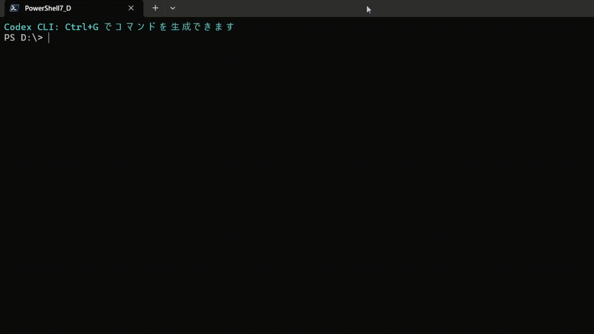

# Codex CLI - Natural Language Command Line Interface

This project uses [GPT-4o](https://openai.com/gpt-4o) to convert natural language commands into PowerShell, Z shell, and Bash commands.

**⚠️ Important Notice: Currently, only PowerShell is fully supported. Bash and ZSH support is experimental and not thoroughly tested.**



The Command Line Interface (CLI) was the first major user interface for interacting with machines. While the CLI is incredibly powerful and capable of almost anything, users must express their intentions very precisely. Users need to "know the computer's language."

With the advent of large language models (LLMs), especially those trained on code, it has become possible to interact with the CLI using natural language (NL). These models understand both natural language and code well enough to translate between the two.

This project aims to provide a cross-shell NL->Code experience, enabling users to interact with their preferred CLI using natural language. Users can input commands (e.g., "What is my IP address?") and press `Ctrl + G` to get command suggestions suitable for their shell. This project uses OpenAI's GPT-4o model, which has excellent code generation capabilities. It employs a technique called prompt engineering (see the [section](#prompt-engineering-and-context-files) below) to extract appropriate commands from the model.

**Note: The model may make mistakes! Please do not execute commands that you do not understand. If you are unsure about the behavior of a command, press `Ctrl + C` to cancel.**

This project takes technical inspiration from the [zsh_codex](https://github.com/tom-doerr/zsh_codex) project, extending its functionality to support multiple shells and customizing the prompts passed to the model (see the prompt engineering section below).

## Purpose Statement
This repository aims to deepen the understanding of using Codex in applications by providing implementations and references to support the [Microsoft Build conference 2022](https://mybuild.microsoft.com/). This is not intended as a released product. Therefore, discussions about the OpenAI API and requests for new features are outside the scope of this repository.

## Requirements
* [Python 3.7.1+](https://www.python.org/downloads/)
    * \[Windows\]: Python must be added to PATH.
* [OpenAI Account](https://openai.com/api/)
    * [OpenAI API Key](https://platform.openai.com/api-keys)
    * [OpenAI Organization Id](https://platform.openai.com/account/organization) (optional, only needed if you have multiple organizations)
    * OpenAI Model Name: For best results, use `gpt-4o`. See [here](#how-to-check-available-openai-models) for checking available models.
* To use the full functionality: Windows PowerShell (Core or Windows PowerShell 5.1+)

## Environment Variables
The API key and Organization ID must be configured using the following environment variables.

* `OPENAI_API_KEY` - Your OpenAI API Key (required)
* `OPENAI_ORGANIZATION_ID` - Your OpenAI Organization ID (optional)
* `OPENAI_MODEL` - The name of the model to use (optional, default is `gpt-4o`)

Examples of setting environment variables:

Setting in PowerShell:
```powershell
$env:OPENAI_API_KEY = "your_api_key_here"
$env:OPENAI_ORGANIZATION_ID = "your_org_id_here"  # optional
```

Setting in Bash/Zsh:
```bash
export OPENAI_API_KEY="your_api_key_here"
export OPENAI_ORGANIZATION_ID="your_org_id_here"  # optional
```

## Installation

To make use of the Codex CLI tool, you need to set up your preferred shell environment. The installation steps for each supported shell environment are as follows.

The following terminal environments are supported:

* [PowerShell](#powershell-steps) (Recommended - Fully Supported)
* [Bash](#bash-steps) (Experimental - Untested)
* [Zsh](#zsh-steps) (Experimental - Untested)

For installation instructions of PowerShell on Linux/macOS, please refer to [this link](https://docs.microsoft.com/powershell/scripting/install/installing-powershell).

### Prerequisites

Ensure that Python is installed to run Codex CLI. To install the required Python packages, enter the following command in the command line of your preferred shell:

```
python -m pip install -r requirements.txt
```

To obtain your OpenAI API key information, visit (https://platform.openai.com/api-keys) and log in to your account.

Once logged in, you will see the following screen:


Click the _Copy_ button to copy the API key and set it as an environment variable.

If you belong to multiple OpenAI organizations and wish to use the API with a specific organization, visit the OpenAI settings page (https://platform.openai.com/account/organization) and copy the ID displayed under the _Organization ID_ heading.

Refer to the image below for assistance:


Regarding the OpenAI model name, please use `gpt-4o` for best results. As explained in the [FAQ](#frequently-asked-questions) section, you can check the available models using the API.

Refer to the image below for assistance:


### Configuration File

Codex CLI uses the following configuration file:

**~/.openai/codex-cli.json** - The configuration file containing language settings and model information:
```json
{
  "model": "gpt-4o",
  "language": "ja"  // Language setting: "en" for English or "ja" for Japanese
}
```

The `language` setting determines the language of the system prompt used during command generation. If not specified, English will be used by default.

**Note**: The API key and Organization ID are obtained from environment variables, not the configuration file.

### PowerShell Steps

1. Download this project to a location of your choice. For example, `C:\your\custom\path\` or `~/your/custom/path`.

```PowerShell
git clone https://github.com/microsoft/Codex-CLI.git C:\your\custom\path\
```

2. Open PowerShell and execute the following command. If you are running this on Windows, make sure to launch PowerShell as "Administrator".

```PowerShell
Set-ExecutionPolicy RemoteSigned -Scope CurrentUser
```

For more information about execution policies, refer to
[about_Execution_Policies](https://docs.microsoft.com/powershell/module/microsoft.powershell.core/about/about_execution_policies).

3. In the same PowerShell terminal, navigate to `C:\your\custom\path\Codex-CLI\` (the folder containing the cloned Codex CLI project). Execute the following command to set up the PowerShell environment:

```PowerShell
.\scripts\powershell_setup.ps1 -OpenAIModelName 'gpt-4o'
```

&nbsp;&nbsp;&nbsp;&nbsp;&nbsp;&nbsp;&nbsp;&nbsp;&nbsp;&nbsp;For script parameters, refer to the [powershell_setup.ps1 section](#about-powershell_setupps1).

4. Set the environment variables:

```PowerShell
$env:OPENAI_API_KEY = "your_api_key_here"
$env:OPENAI_ORGANIZATION_ID = "your_org_id_here"  # optional
```

5. Open a new PowerShell session, type in a natural language command prefixed with `#`, and press `Ctrl + G`!

#### Cleanup
Once you are done, navigate to `C:\your\custom\path\` (the folder containing the cloned Codex CLI project) and execute the following command to clean up.
```
.\scripts\powershell_cleanup.ps1
```

This will remove the API key and Organization ID information from the configuration file. It is also recommended to remove the environment variables:

```PowerShell
Remove-Item Env:OPENAI_API_KEY -ErrorAction SilentlyContinue
Remove-Item Env:OPENAI_ORGANIZATION_ID -ErrorAction SilentlyContinue
```

To revert the execution policy, run this command
```
Set-ExecutionPolicy Undefined -Scope CurrentUser
```

#### Troubleshooting PowerShell

If Codex CLI is not working despite a successful setup, please check the following issues:

1. **Environment variables are not set**:
   ```PowerShell
   # Check if the environment variables are set correctly
   echo $env:OPENAI_API_KEY
   echo $env:OPENAI_ORGANIZATION_ID
   
   # If not set, configure them
   $env:OPENAI_API_KEY = "your_api_key_here"
   ```

2. **Ctrl+G key binding conflicts**:
   
   If VSCode, a browser, or another application is using the Ctrl+G key, you can address this by:
   
   a. **Using an alternative key binding**:
      Edit your PowerShell profile to set a different key binding.
      ```PowerShell
      # Open the $PROFILE file
      notepad $PROFILE
      ```
      
      Look for the following line (located between "### Codex CLI setup - start" and "### Codex CLI setup - end"):
      ```
      Set-PSReadLineKeyHandler -Key Ctrl+g -Function SendToCodex
      ```
      
      Change this to a different key binding (e.g., Ctrl+Alt+G):
      ```
      Set-PSReadLineKeyHandler -Key Ctrl+Alt+g -Function SendToCodex
      ```
      
   b. **Temporarily closing applications**:
      Try temporarily closing other applications that are using the Ctrl+G key.

3. **Python-related issues**:
   - Ensure Python is installed and added to PATH.
   - Ensure the required packages are installed：
     ```
     python -m pip install -r <repository_path>/requirements.txt
     ```
     
4. **Checking the configuration file**:
   Ensure the following files exist and are correctly configured:
   - $PROFILE (PowerShell profile)
   - $HOME/.openai/codex-cli.json (configuration file)
   
   To check the settings:
   ```PowerShell
   # Display profile file content
   Get-Content $PROFILE
   
   # Display configuration file content if it exists
   Get-Content -Path "$HOME/.openai/codex-cli.json" -ErrorAction SilentlyContinue
   ```

5. **Manually executing commands**:
   Try manually invoking the functions added to your PowerShell profile:
   ```PowerShell
   Invoke-Codex "List the contents of the directory"
   ```
   If an error message appears, it may help identify the specific problem.

6. **Running the diagnostic script**:
   If the problem persists, run the diagnostic script:
   ```powershell
   .\scripts\debug_setup.ps1
   ```

#### About powershell_setup.ps1
`powershell_setup.ps1` supports the following parameters:
| Parameter          | Type                                                                       | Description                                                                                                                                                                  |
| ------------------ | -------------------------------------------------------------------------- | ---------------------------------------------------------------------------------------------------------------------------------------------------------------------------- |
| `-OpenAIModelName` | String                                                                     | Optional. The name of the OpenAI model (e.g., `gpt-4o`). Provides access to the model. Default is `gpt-4o`.                                                                  |
| `-Language`        | String                                                                     | Optional. Specifies the language to be used (e.g., `ja`, `en`). Default is `ja` (Japanese).                                                                                  |
| `-RepoRoot`        | [FileInfo](https://docs.microsoft.com/en-us/dotnet/api/system.io.fileinfo) | Optional. Defaults to the current folder.<br>Value should be the path to the Codex CLI folder. Example:<br/>`.\scripts\powershell_setup.ps1 -RepoRoot 'C:\your\custom\path'` |

### Bash Steps (Experimental - Untested)

**Note: Bash support is intended for use with Windows Subsystem for Linux (WSL) and Linux environments, and is currently in an experimental stage, not thoroughly tested. Issues may arise.**

To utilize Codex CLI with Bash on WSL or Linux, follow these steps:

1. Open a Bash shell and use the following command to clone the Codex CLI repository, downloading the Codex CLI project to your preferred location on Linux:
    ```
    $ git clone https://github.com/microsoft/Codex-CLI.git /your/custom/path/
    ```

2. Once the project is cloned, navigate to the directory containing the Codex CLI code.
    ```
    cd </your/custom/path>/Codex-CLI
    ```

3. Set up the Bash Codex CLI environment.

    Inside the Codex CLI folder, there is a folder named `scripts`, which contains a script called `bash_setup.sh` for setting up the Bash environment.

    To set up the environment, please execute the following command:
    ```
    cd scripts
    source bash_setup.sh -e gpt-4o
    ```
    
    The script will create the OpenAI settings file and update the Bash environment.

4. Set the environment variables:
    ```bash
    export OPENAI_API_KEY="your_api_key_here"
    export OPENAI_ORGANIZATION_ID="your_org_id_here"  # optional
    ```

5. Open a new Bash terminal. Type your request in natural language prefixed with `#`. Press `Ctrl + G` to execute!

#### Cleanup

Once you are done with the Codex CLI tool, navigate to the folder containing the Codex CLI code. Example: `cd ~/your/custom/path/Codex-CLI`. Execute the following command to clean up the Codex CLI Bash environment.
```
source ./scripts/bash_cleanup.sh
```

To remove the environment variables:
```bash
unset OPENAI_API_KEY
unset OPENAI_ORGANIZATION_ID
```

Once done, close the terminal session.

#### About bash_setup.sh

`bash_setup.sh` supports the following parameters:

| Parameter    | Description                                                    |
| ------------ | -------------------------------------------------------------- |
| `-e <value>` | Specifies the OpenAI model name (e.g., `gpt-4o`) (required)    |
| `-l <value>` | Language setting (e.g., `ja`, `en`). Default is `en` (English) |

Example:

```
source bash_setup.sh -e gpt-4o -l ja
```

For help regarding the execution of the Codex CLI Bash setup, you can run the following command:
```
source bash_setup.sh -h
```

### Zsh Steps (Experimental - Untested)

**Note: Zsh support is currently experimental and has not been thoroughly tested. Issues may arise.**

1. Download this project to `~/your/custom/path/`.

```
$ git clone https://github.com/microsoft/Codex-CLI.git ~/your/custom/path/
```

2. In zsh, navigate to `~/your/custom/path/` (the folder containing the Codex CLI code) and execute the following command to set up the zsh environment:

```
./scripts/zsh_setup.sh -e gpt-4o
```

3. Set the environment variables:

```bash
export OPENAI_API_KEY="your_api_key_here"
export OPENAI_ORGANIZATION_ID="your_org_id_here"  # optional
```

4. Run `zsh`, start typing, and complete with `^G` (Ctrl+G)!

#### Cleanup
Once you are done, navigate to `~/your/custom/path/` (the folder containing the Codex CLI code) and execute the following command to clean up.
```
./scripts/zsh_cleanup.sh
```

To remove the environment variables:
```bash
unset OPENAI_API_KEY
unset OPENAI_ORGANIZATION_ID
```

#### About zsh_setup.sh
`zsh_setup.sh` supports the following parameters:
| Parameter    | Description                                                    |
| ------------ | -------------------------------------------------------------- |
| `-e <value>` | Specifies the OpenAI model name (e.g., `gpt-4o`) (required)    |
| `-l <value>` | Language setting (e.g., `ja`, `en`). Default is `en` (English) |

### Where Security Information is Stored

Information such as the OpenAI API key that you input is stored as environment variables. Also, language settings and model information are stored in the following locations according to each shell environment:

#### For PowerShell, the information is stored in:
PowerShellプロファイルに挿入されるテンプレートであり、以下の機能を提供します： 
```
$HOME/.openai/codex-cli.json
```
(Usually `C:\Users\Username\.openai\codex-cli.json` on Windows)

#### For Bash, the information is stored in:
```
~/.openai/settings.json
```

#### For Zsh, the information is stored in:
```
~/.openai/settings.json
```

These configuration files are properly removed or initialized when the cleanup process for each shell environment (e.g., `bash_cleanup.sh`, `zsh_cleanup.sh`, `powershell_cleanup.ps1`) is executed. For security, it is recommended to run the cleanup script to remove the API key from the environment variables once you are done using the tool.

## Recent Updates

The project now uses a unified script (`codex_query_integrated.py`) that consolidates the features of the previous versions:

- **Streaming Response**: See the generated command in real-time
- **Multi-language Support**: Interface in English and Japanese
- **Shell Detection**: Automatically detects shell environment (currently optimized for PowerShell)
- **Improved UTF-8 Support**: Better handling of non-ASCII characters
- **Environment Variable-based Authentication**: API key and Organization ID are now retrieved from environment variables

## Usage

Once the setup for PowerShell is complete, you can use the Codex CLI by writing comments (starting with `#`) in the shell and pressing `Ctrl + G`.

You can also directly invoke the CLI using the `Invoke-Codex` command:
```powershell
Invoke-Codex "Find files larger than 1GB"
```

The Codex CLI primarily supports two modes: single-turn and multi-turn.

By default, the multi-turn mode is off. You can toggle it on/off using the `# start multi-turn` and `# stop multi-turn` commands.

When the multi-turn mode is on, the Codex CLI "remembers" past interactions with the model and can refer to previous actions or entities. For example, if you change the timezone to mountain in the Codex CLI and then say "change it back to pacific," the model will remember from the last interaction that "it" refers to your timezone:

```powershell
# change my timezone to mountain
tzutil /s "Mountain Standard Time"

# change it back to pacific
tzutil /s "Pacific Standard Time"
```

This tool creates a `current_context.txt` file to keep track of past interactions and passes them to the model with each subsequent command.

When the multi-turn mode is off, this tool does not keep track of the interaction history. There are pros and cons to the multi-turn mode - while it enables contextual resolution, it also increases overhead. For instance, if the model generates an incorrect script, the user would want to remove it from the context. Otherwise, there is a high chance that the wrong script will be generated in future conversation turns as well. Turning off the multi-turn mode makes the model behave completely deterministically - the same command will always produce the same output.

If the model seems to be consistently outputting the wrong command, you can use the `# stop multi-turn` command to stop the model from remembering past interactions and load the default context. Alternatively, the `# default context` command has a similar effect while keeping the multi-turn mode on.

## Commands

| Command                           | Description                                                                                             |
| --------------------------------- | ------------------------------------------------------------------------------------------------------- |
| `start multi-turn`                | Starts the multi-turn experience                                                                        |
| `stop multi-turn`                 | Stops the multi-turn experience and loads the default context                                           |
| `load context <filename>`         | Loads a context file from the `contexts` folder                                                         |
| `default context`                 | Loads the default shell context                                                                         |
| `view context`                    | Opens the context file in a text editor                                                                 |
| `save context <filename>`         | Saves the context file to the `contexts` folder. Uses the current date and time if no name is specified |
| `show config`                     | Displays the current configuration for interacting with the model                                       |
| `set <config-key> <config-value>` | Modifies the configuration for interacting with the model                                               |

You can enhance your experience by using the set command to change the token limit, model name, temperature, etc. Examples: `# set engine gpt-4o`, `# set temperature 0.5`, `# set max_tokens 50`.

## Prompt Engineering and Context Files

This project uses a technique called "prompt engineering" to tune GPT-4o to generate commands from natural language. Specifically, it involves providing the model with a series of NL->Commands examples to give it a sense of what kind of code to write and prompting it to generate commands appropriate to the shell in use. These examples are located in the `contexts` directory. Below is an excerpt from the PowerShell context:

```powershell
# what's the weather in New York?
(Invoke-WebRequest -uri "wttr.in/NewYork").Content

# make a git ignore with node modules and src in it
"node_modules
src" | Out-File .gitignore

# open it in notepad
notepad .gitignore
```

This project models natural language commands as comments and provides examples of the expected PowerShell scripts to the model. These examples include single-line completions, multi-line completions, and multi-turn completions (the example "open it in notepad" refers to the `.gitignore` file generated in the previous turn).

When a user inputs a new command (like "what's my IP address"), this command is added to the context (as a comment), and GPT-4o is asked to generate the following code. Looking at the above examples, GPT-4o should understand that it needs to write a short PowerShell script that fulfills the comment.

## Building Your Own Context

This project comes pre-loaded with contexts for each shell and some bonus contexts with other functionalities. In addition to these, you can build your own contexts to elicit other behaviors from the model. For instance, if you want Codex CLI to generate Kubernetes scripts, you could create a new context that includes examples of commands and the `kubectl` scripts you want the model to generate:

```bash
# make a K8s cluster IP called my-cs running on 5678:8080
kubectl create service clusterip my-cs --tcp=5678:8080
```

Add the context to the `contexts` folder and load it by running `load context <filename>`. You can also change the default context in `src\prompt_file.py` to your context file.

GPT-4o often generates the correct script even without examples. It has been trained on a vast amount of code and often knows how to generate a specific command. However, building your own context can help elicit the specific kind of script you are looking for (whether long or short, whether to declare variables, whether to refer to previous commands, etc.). You can also provide examples of your CLI commands or scripts to indicate other tools you want GPT-4o to consider using.

The important thing is to turn on the multi-turn mode and avoid the automatic default setting (a feature added to prevent the experience from breaking) when adding new contexts.

As an example, a [Cognitive Services context](./contexts/CognitiveServiceContext.md) using the Cognitive Services API, which provides text-to-speech type responses, has been added.

## Troubleshooting

### Common Issues
- **No response when pressing Ctrl+G**: Ensure your query starts with `#` followed by a space
- **Error indicating missing API key**: Check that the environment variable `OPENAI_API_KEY` is set correctly
- **Japanese text not displaying correctly**: Ensure your console is set to UTF-8 encoding

### Debugging
Use `DEBUG_MODE` to debug the code using terminal input instead of standard input. This is helpful when adding new commands or trying to understand why the tool is not responding.

If you are a PowerShell user facing issues, run the diagnostic script:
```powershell
.\scripts\debug_setup.ps1
```

The `openai` package might throw errors that are not caught by the tool. In such cases, you can add a catch block for that exception at the end of `codex_query_integrated.py` to display a custom error message.

## Frequently Asked Questions
### How to Check Available OpenAI Models
You may have access to different OpenAI models for each OpenAI organization. To check the available models, you can use the [List models API](https://platform.openai.com/docs/api-reference/models/list). Refer to the following commands:

* Shell
    ```
    curl https://api.openai.com/v1/models \
      -H 'Authorization: Bearer YOUR_API_KEY' \
      -H 'OpenAI-Organization: YOUR_ORG_ID'
    ```

* PowerShell

    PowerShell v5 (Default version that comes with Windows)
    ```powershell
    (Invoke-WebRequest -Uri https://api.openai.com/v1/models -Headers @{"Authorization" = "Bearer YOUR_API_KEY"; "OpenAI-Organization" = "YOUR_ORG_ID"}).Content
    ```

    PowerShell v7
    ```powershell
    (Invoke-WebRequest -Uri https://api.openai.com/v1/models -Authentication Bearer -Token (ConvertTo-SecureString "YOUR_API_KEY" -AsPlainText -Force) -Headers @{"OpenAI-Organization" = "YOUR_ORG_ID"}).Content
    ```

### Can I run the samples on Azure?
The sample code works with the OpenAI API's GPT-4o and can also be used with the [Azure OpenAI Service](https://aka.ms/azure-openai) if you have access to GPT-4o via Azure.

## About the Script Files for PowerShell Environment

The Codex CLI project includes several script files to ease the setup and management of the PowerShell environment.

### scripts\powershell_setup.ps1
This script is the main script for setting up Codex CLI in the PowerShell environment. Specifically, it does the following:
- Creates or updates the PowerShell profile (`$PROFILE`)
- Checks for the `PSReadLine` module (needed for key bindings)
- Sets the OpenAI model name
- Creates the settings file (`~/.openai/codex-cli.json`)

Usage example:
```powershell
# Basic usage
.\scripts\powershell_setup.ps1 -OpenAIModelName 'gpt-4o'

# If specifying a custom repository path
.\scripts\powershell_setup.ps1 -RepoRoot 'C:\path\to\repo' -OpenAIModelName 'gpt-4o'
```

### scripts\powershell_cleanup.ps1
This script removes all Codex CLI settings and reverts the PowerShell environment to its original state. It does the following:
- Removes Codex CLI related settings from the PowerShell profile
- Deletes the OpenAI API settings file
- Updates the `~/.openai/codex-cli.json` file (removes API key information)

Usage example:
```powershell
.\scripts\powershell_cleanup.ps1
```
After running, restart PowerShell to reflect the changes.

### scripts\debug_setup.ps1
A diagnostic script used for troubleshooting issues. If Codex CLI is not functioning correctly, this script can help identify environment setup or path issues:

```powershell
.\scripts\debug_setup.ps1
```

### scripts\powershell_plugin.ps1
This file is a template that gets inserted into your PowerShell profile, providing the following functionalities:
- Definition of the `SendToCodex` function (translates natural language queries to commands)
- `Invoke-Codex` alias function (can be called directly from the command line)
- Ctrl+G key binding

You do not need to edit this file directly, but it can be referenced if you want to customize the key binding.
